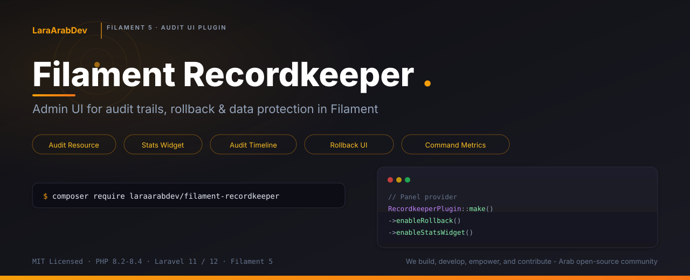

<p align="center">
    
</p>

<h1 align="center">Filament Recordkeeper</h1>

<p align="center">
    <strong>Admin UI for audit trails, rollback & data protection in Filament</strong>
</p>

<p align="center">
    <a href="https://packagist.org/packages/laraarabdev/filament-recordkeeper"></a>
    <a href="https://packagist.org/packages/laraarabdev/filament-recordkeeper"></a>
    <a href="https://packagist.org/packages/laraarabdev/filament-recordkeeper"></a>
    <a href="https://packagist.org/packages/laraarabdev/filament-recordkeeper"></a>
    <a href="https://filamentphp.com"></a>
    <a href="https://laravel.com"></a>
</p>

<p align="center">
    <a href="https://github.com/LaraArabDev/filament-recordkeeper/actions/workflows/tests.yml"></a>
    <a href="https://codecov.io/gh/LaraArabDev/filament-recordkeeper"></a>
    <a href="https://github.com/LaraArabDev/filament-recordkeeper/actions/workflows/static-analysis.yml"></a>
    <a href="https://github.com/LaraArabDev/filament-recordkeeper/actions/workflows/security.yml"></a>
    <a href="https://github.com/LaraArabDev/filament-recordkeeper/actions/workflows/code-style.yml"></a>
</p>

<p align="center">
    A Filament 5 plugin that gives you a full admin UI on top of
    <a href="https://github.com/LaraArabDev/recordkeeper"><code>laraarabdev/recordkeeper</code></a>
    — browse audits, view diffs, rollback changes, and monitor command performance from your panel.<br>
    PHP 8.2 – 8.4 · Laravel 11 / 12 · Filament 5
</p>

<p align="center">
    <b><a href="https://github.com/LaraArabDev">LaraArabDev</a></b> — We build, develop, empower, and contribute. An Arab open-source community crafting production-grade Laravel packages.<br>
    <b><a href="https://github.com/LaraArabDev">LaraArabDev</a></b> — نبني، نطوّر، نُمكّن، ونُساهم. مجتمع عربي مفتوح المصدر يصنع حزم Laravel احترافية وجاهزة للإنتاج.
</p>

<p align="center">
    <a href="#-quick-start">Quick Start</a> ·
    <a href="#-plugin-api">Plugin API</a> ·
    <a href="#-audit-resource">Audit Resource</a> ·
    <a href="#-widgets">Widgets</a> ·
    <a href="#-relation-manager">Relation Manager</a> ·
    <a href="#-العربية">العربية</a>
</p>

---

## What is Filament Recordkeeper?

Filament Recordkeeper is a **Filament 5 plugin** that provides a complete admin UI for the [`laraarabdev/recordkeeper`](https://github.com/LaraArabDev/recordkeeper) audit package. It turns your raw audit data into a browseable, filterable, and actionable admin experience:

- **Audit Resource** — paginated table with event tabs, global search, 8 filters, and inline revert action
- **View Page** — before/after diff viewer with color-coded changes, context metadata, outbound HTTP requests, and permission-gated rollback with dry-run preview
- **Stats Widget** — six dashboard stat cards showing audit counts by event type and distinct actors
- **Timeline Widget** — recent audit activity feed showing the latest 20 entries
- **Command Metrics Widget** — dual-axis bar chart visualizing command duration and audit impact with anomaly detection
- **Relation Manager** — embeddable audit history tab for any Filament resource
- **HasAuditHistory Trait** — one line to add the audit history tab to your resource

> **Only need headless audit + rollback (API / no admin panel)?** Install
> [`laraarabdev/recordkeeper`](https://github.com/LaraArabDev/recordkeeper) directly — this
> package is just the Filament presentation layer on top of it. All auditing logic, privacy controls, rollback engine, Artisan commands, and storage drivers come from the core package.

---

## 📦 Prerequisites

| Requirement | Version |
| --- | --- |
| PHP | 8.2, 8.3, or 8.4 |
| Laravel | 11 or 12 |
| Filament | 5.x |
| laraarabdev/recordkeeper | ^1.0 (auto-installed) |

---

## 🚀 Quick Start

### Install

```bash
composer require laraarabdev/filament-recordkeeper
php artisan recordkeeper:install
php artisan migrate
```

The core `laraarabdev/recordkeeper` package is installed automatically as a dependency — no need to install it separately.

### Register the plugin

Add the plugin to your Filament panel provider:

```php
use LaraArabDev\RecordkeeperFilament\RecordkeeperPlugin;

public function panel(Panel $panel): Panel
{
    return $panel->plugins([
        RecordkeeperPlugin::make(),
    ]);
}
```

That's it — the audit resource is now available in your panel sidebar.

### Enable features

All widgets and rollback are opt-in. Enable what you need:

```php
RecordkeeperPlugin::make()
    ->enableRollback()           // show rollback action on audit view
    ->enableStatsWidget()        // register stats overview widget
    ->enableTimeline()           // register timeline widget
    ->enableCommandMetrics()     // register command performance chart
```

### Add audit history to resources

```php
use LaraArabDev\RecordkeeperFilament\Concerns\HasAuditHistory;

class OrderResource extends Resource
{
    use HasAuditHistory;
}
```

This adds a "History" tab with an audit table on every order's detail page.

---

## ⚙️ Plugin API

Configure everything through a fluent builder — all methods return `$this` for chaining:

```php
RecordkeeperPlugin::make()
    ->enableRollback()                          // show rollback button
    ->enableStatsWidget()                       // stats dashboard widget
    ->enableTimeline()                          // timeline dashboard widget
    ->enableCommandMetrics()                    // command chart widget
    ->navigationGroup('Audit')                  // sidebar group label
    ->navigationSort(50)                        // sidebar sort order
    ->navigationIcon('heroicon-o-shield-check') // sidebar icon
```

### All methods

| Method | Default | Description |
| --- | --- | --- |
| `enableRollback(bool)` | `false` | Show the rollback/revert button on the audit detail page and inline on list rows. Requires `recordkeeper.rollback.enabled` to also be `true` in the core config. |
| `enableStatsWidget(bool)` | `false` | Register the `AuditStatsOverview` widget on the panel dashboard. |
| `enableTimeline(bool)` | `false` | Register the `AuditTimeline` widget on the panel dashboard. |
| `enableCommandMetrics(bool)` | `false` | Register the `CommandMetricsWidget` on the panel dashboard. Only visible when `recordkeeper.commands.metrics.memory` or `recordkeeper.commands.metrics.audit_count` is enabled. |
| `navigationGroup(string\|UnitEnum)` | `'Audit'` | Sidebar navigation group label for the audit resource. Accepts a string or a `UnitEnum`. |
| `navigationSort(int)` | `100` | Sort order of the audit resource in the sidebar. |
| `navigationIcon(string\|BackedEnum\|Htmlable)` | `'heroicon-o-clock'` | Icon displayed next to the audit resource in the sidebar. Accepts a Heroicon name, `BackedEnum`, or `Htmlable`. |

---

## 📋 Audit Resource

The audit resource is the main page of the plugin — a full Filament resource backed by the `Audit` model.

### List page

**URL:** `/admin/audits` (or your panel path)

The list page provides:

- **Event tabs** — filter by All, Created, Updated, Deleted, and Routes with badge counts (powered by a single optimized SQL query using conditional aggregation)
- **Sortable columns** — Time (relative with ISO tooltip), Event (color-coded badge), Subject (`ModelName #ID`), Actor (`UserType #ID` or `system`), Guard, Batch ID, IP, URL
- **Toggle columns** — Guard, Batch ID, IP, and URL are hidden by default, toggleable from the column picker
- **Global search** — search across event name, auditable type, and batch ID
- **Default sort** — newest first (`created_at DESC`)

### Filters

The list page has 8 filters across 2 columns:

| Filter | Type | Description |
| --- | --- | --- |
| **Event** | Multi-select | Filter by event names (auto-populated from existing audits) |
| **Model** | Multi-select | Filter by auditable type (shows short class name) |
| **Guard** | Select | Filter by authentication guard (`web`, `api`, etc.) |
| **Actor type** | Select | Filter by user type (shows short class name) |
| **Actor ID** | Text input | Filter by specific user ID |
| **Period** | Date range | Filter by date range (from / until) |
| **Batch ID** | Text input | Filter by batch identifier |
| **Rollbackable** | Ternary | Show only rollbackable / non-rollbackable / all |

Filters persist in the session — they survive page navigation and browser refresh.

### Row actions

| Action | Icon | Description |
| --- | --- | --- |
| **View** | Eye | Navigate to the audit detail page |
| **Revert** | Arrow U-turn | Rollback this single audit (requires confirmation). Only visible when rollback is enabled and the audit is rollbackable (`created`, `updated`, `deleted`, `restored`). |

### Bulk actions

| Action | Description |
| --- | --- |
| **Prune selected** | Delete selected audit records. Only visible to users with the `prune_audits` permission. |

### View page

**URL:** `/admin/audits/{id}`

The detail page shows four sections:

#### 1. Overview

3-column layout with: Event (badge), Subject (`Model #ID`), Actor, Guard (badge), IP address, Time (full datetime), and Batch ID.

#### 2. Changes

Side-by-side key-value display:
- **Before** — `old_values` (the state before the change)
- **After** — `new_values` (the state after the change)

#### 3. Context

Key-value display of the `context` JSON column. Only visible when context data exists. Contains route info, duration, command metrics, or any custom context pushed via `Recordkeeper::pushContext()`.

#### 4. Outbound HTTP Requests

A repeatable table showing all HTTP requests made during this audit's context (e.g. API calls made by a job). Shows: Method (badge), URL, Status Code (color-coded: green < 300, yellow < 400, red >= 400), Duration (ms), and Failed status. Only visible when `recordkeeper.http.enabled` is `true` and the audit has associated HTTP request records.

#### Rollback action

The view page has a header action button **"Revert this change"** that:
1. Shows a dry-run preview modal with the changes that will be reverted
2. Requires confirmation before applying
3. Only visible when: the record is a model audit (`created`, `updated`, `deleted`), rollback is enabled in the plugin, AND rollback is enabled in core config

### Event color coding

Events are color-coded consistently throughout the entire UI:

| Event | Color | Badge |
| --- | --- | --- |
| `created` | Green (`success`) | |
| `updated` | Yellow (`warning`) | |
| `deleted` / `forceDeleted` | Red (`danger`) | |
| `route.*` | Blue (`info`) | |
| All others | Gray (`gray`) | |

### Guard color coding

| Guard | Color |
| --- | --- |
| `web` | Gray |
| `api` | Blue (`info`) |
| Other | Yellow (`warning`) |

---

## 📊 Widgets

All widgets are opt-in — register them via the plugin builder. They appear on your Filament dashboard.

### Stats Overview

Six stat cards with aggregate audit counts:

| Card | Icon | Color | Value |
| --- | --- | --- | --- |
| Total Audits | Clock | — | Total count of all audit records |
| Created | Plus Circle | Green | Count of `created` events |
| Updated | Pencil | Yellow | Count of `updated` events |
| Deleted | Trash | Red | Count of `deleted` + `forceDeleted` events |
| Route Hits | Globe | Blue | Count of `route.*` events |
| Distinct Actors | Users | — | Count of unique `user_id` values |

**Performance:** Uses a single SQL query with conditional aggregation (`SUM(CASE WHEN ...)`) instead of 6 separate `COUNT` queries.

```php
RecordkeeperPlugin::make()
    ->enableStatsWidget()
```

### Audit Timeline

A full-width table widget showing the 20 most recent audit entries — designed as a quick activity feed.

Columns: Time (relative), Event (color-coded badge), Subject (`Model #ID`), Actor (`UserType #ID` or `system`).

```php
RecordkeeperPlugin::make()
    ->enableTimeline()
```

### Command Metrics

A dual-axis bar chart visualizing Artisan command performance:

- **Left Y-axis (bars):** Command execution duration in milliseconds
- **Right Y-axis (line):** Audit impact count (number of audits generated by the command)
- **X-axis:** Last 14 runs of the selected command
- **Anomaly detection:** Bars turn red when the run was flagged as anomalous
- **Filter dropdown:** Select which command to visualize (auto-populated from recent command audits)

Only visible when at least one command metrics config option is enabled in `recordkeeper.commands.metrics`.

```php
RecordkeeperPlugin::make()
    ->enableCommandMetrics()
```

---

## 🔗 Relation Manager

The `AuditsRelationManager` provides an embeddable audit history tab for any Filament resource. It connects via the `audits` morphMany relationship on the parent model.

### What it shows

| Column | Description |
| --- | --- |
| Time | Relative timestamp (`since()`) |
| Event | Color-coded badge |
| Actor | `UserType #ID` or `system` |

### Actions per row

| Action | Description |
| --- | --- |
| **View** | Opens the full audit detail page in a new tab |
| **Revert** | Rollback this change (with confirmation). Only visible when rollback is enabled and the audit is rollbackable. |

### Usage — HasAuditHistory trait

The simplest way to add the relation manager:

```php
use LaraArabDev\RecordkeeperFilament\Concerns\HasAuditHistory;

class OrderResource extends Resource
{
    use HasAuditHistory;
}
```

The trait merges `AuditsRelationManager` into the resource's `getRelationManagers()` array, so it works alongside any existing relation managers you have.

### Usage — manual registration

If you prefer explicit control:

```php
use LaraArabDev\RecordkeeperFilament\RelationManagers\AuditsRelationManager;

class OrderResource extends Resource
{
    public static function getRelationManagers(): array
    {
        return [
            AuditsRelationManager::class,
        ];
    }
}
```

### Prerequisites

Your model must have the `audits` relationship. If your model uses the core `AuditsChanges` trait (or implements `OwenIt\Auditing\Contracts\Auditable`), this relationship already exists.

---

## 🎨 Customizing Views

The plugin ships with a Blade view for the rollback preview modal. You can publish and customize it:

```bash
php artisan vendor:publish --tag=recordkeeper-filament-views
```

This copies the views to `resources/views/vendor/recordkeeper/` where you can modify them.

---

## 🏗️ Architecture

This package is a **pure Filament presentation layer**. It contains zero business logic — everything is delegated to the core `laraarabdev/recordkeeper` package:

```
┌─────────────────────────────────────────────────┐
│  filament-recordkeeper (this package)            │
│                                                  │
│  RecordkeeperPlugin     → Filament plugin API    │
│  AuditResource          → List + View pages      │
│  AuditStatsOverview     → Stats widget           │
│  AuditTimeline          → Timeline widget        │
│  CommandMetricsWidget   → Chart widget           │
│  AuditsRelationManager  → Embeddable history tab │
│  HasAuditHistory        → One-line trait          │
│  AuditFormatter         → Shared UI helpers       │
│  ServiceProvider        → Views only              │
└───────────────┬─────────────────────────────────┘
                │ depends on
┌───────────────▼─────────────────────────────────┐
│  recordkeeper (core package)                     │
│                                                  │
│  Audit model, rollback engine, privacy pipeline, │
│  PHP 8 attributes, Artisan commands, middleware,  │
│  storage drivers, job/command/event tracking      │
└─────────────────────────────────────────────────┘
```

### File structure

```
src/
├── Concerns/
│   └── HasAuditHistory.php          # Trait — adds relation manager to resources
├── RelationManagers/
│   └── AuditsRelationManager.php    # Embeddable audit history tab
├── Resources/
│   ├── AuditResource.php            # Main resource (table + infolist)
│   └── Pages/
│       ├── ListAudits.php           # List page with event tabs
│       └── ViewAudit.php            # Detail page with rollback action
├── Support/
│   └── AuditFormatter.php           # Event colors, actor/subject labels, canRevert
├── Widgets/
│   ├── AuditStatsOverview.php       # Stats dashboard widget
│   ├── AuditTimeline.php            # Recent activity table widget
│   └── CommandMetricsWidget.php     # Command performance chart
├── RecordkeeperPlugin.php           # Filament plugin (builder API)
└── RecordkeeperFilamentServiceProvider.php  # Views bootstrap
```

---

## 🔐 Rollback — How It Works in the UI

Rollback is **disabled by default** and requires two conditions to be met:

1. **Plugin level:** `RecordkeeperPlugin::make()->enableRollback()`
2. **Core level:** `config('recordkeeper.rollback.enabled')` must be `true` (default)

When both are enabled, the revert button appears in three places:

| Location | Behavior |
| --- | --- |
| **List page row action** | Inline revert with confirmation dialog |
| **View page header action** | Revert with dry-run preview modal showing before/after changes |
| **Relation manager row action** | Inline revert with confirmation dialog |

Only rollbackable events show the revert button: `created`, `updated`, `deleted`, `restored`.

| Original Event | What Rollback Does |
| --- | --- |
| `created` | Force-deletes the model |
| `updated` | Restores old values |
| `deleted` | Restores the model (supports SoftDeletes) |

---

## 🧪 Testing

```bash
composer test
```

The test suite covers the plugin builder API, service provider registration, `AuditFormatter` helpers, relation manager configuration, and widget setup.

---

## 📖 Core Package Documentation

All auditing logic lives in the core [`laraarabdev/recordkeeper`](https://github.com/LaraArabDev/recordkeeper) package. See its README for:

- Model setup with `AuditsChanges` trait
- PHP 8 Attributes (`#[Auditable]`, `#[Redact]`, `#[Encrypt]`, `#[AuditJob]`, `#[AuditCommand]`, `#[AuditEvent]`)
- Route & API auditing middleware
- Global route auditing (`RECORDKEEPER_ROUTES=true`)
- Outbound HTTP tracking (`RECORDKEEPER_HTTP=true`)
- Job, command, and event lifecycle tracking
- Privacy protection (auto-redact + AES encrypt)
- Rollback API and batch operations
- Fluent query builder
- 8 Artisan commands
- 4 storage drivers (database, Redis, log, null)
- Full configuration reference

---

## 🔐 Security

Please review [our security policy](SECURITY.md) on how to report security vulnerabilities.

---

## 📄 Credits & License

- [LaraArabDev](https://github.com/LaraArabDev)
- [All Contributors](../../contributors)

MIT License — see [LICENSE](LICENSE) for details.

---

## 🇸🇦 العربية

<div dir="rtl" align="right">

### ما هو Filament Recordkeeper؟

**Filament Recordkeeper** هو إضافة (Plugin) لـ Filament 5 توفّر واجهة إدارة كاملة فوق حزمة [`laraarabdev/recordkeeper`](https://github.com/LaraArabDev/recordkeeper) للتدقيق. تحوّل بيانات التدقيق الخام إلى تجربة إدارية قابلة للتصفح والفلترة والتفاعل.

> **لا تحتاج لوحة إدارة؟** ثبّت [`laraarabdev/recordkeeper`](https://github.com/LaraArabDev/recordkeeper) مباشرة — هذه الحزمة هي طبقة عرض Filament فقط فوقها.

### ماذا تتضمّن؟

| المكوّن | الوصف |
| --- | --- |
| **Audit Resource** | جدول مُقسّم بعلامات تبويب (الكل، إنشاء، تعديل، حذف، مسارات) مع بحث شامل و8 فلاتر |
| **صفحة العرض** | عارض الفروقات قبل/بعد مع تمييز الألوان، ومعاينة التراجع، وطلبات HTTP الصادرة |
| **ودجت الإحصائيات** | 6 بطاقات إحصائية — إجمالي التدقيقات، إنشاء، تعديل، حذف، طلبات المسارات، المستخدمين الفريدين |
| **ودجت الجدول الزمني** | آخر 20 عملية تدقيق في جدول سريع |
| **ودجت أداء الأوامر** | رسم بياني ثنائي المحاور لمدة تنفيذ الأوامر وتأثير التدقيق مع كشف الشذوذ |
| **مدير العلاقات** | تبويب سجل التدقيق قابل للتضمين في أي ريسورس |
| **HasAuditHistory** | سطر واحد لإضافة تبويب سجل التدقيق |

### المتطلبات

| المتطلب | الإصدار |
| --- | --- |
| PHP | 8.2، 8.3، أو 8.4 |
| Laravel | 11 أو 12 |
| Filament | 5.x |
| laraarabdev/recordkeeper | ^1.0 (يُثبّت تلقائياً) |

### التثبيت

```bash
composer require laraarabdev/filament-recordkeeper
php artisan recordkeeper:install
php artisan migrate
```

حزمة `laraarabdev/recordkeeper` الأساسية تُثبّت تلقائياً — لا حاجة لتثبيتها يدوياً.

### تسجيل الإضافة

أضف الإضافة في مزوّد لوحة Filament:

```php
use LaraArabDev\RecordkeeperFilament\RecordkeeperPlugin;

public function panel(Panel $panel): Panel
{
    return $panel->plugins([
        RecordkeeperPlugin::make()
            ->enableRollback()           // إظهار زر التراجع
            ->enableStatsWidget()        // ودجت الإحصائيات
            ->enableTimeline()           // ودجت الجدول الزمني
            ->enableCommandMetrics()     // ودجت أداء الأوامر
            ->navigationGroup('التدقيق') // تسمية المجموعة في الشريط الجانبي
            ->navigationSort(50)         // ترتيب العرض
            ->navigationIcon('heroicon-o-shield-check'),
    ]);
}
```

### جميع خيارات الإعداد

| الطريقة | الافتراضي | الوصف |
| --- | --- | --- |
| `enableRollback(bool)` | `false` | إظهار زر التراجع/الاسترجاع. يتطلب أيضاً `recordkeeper.rollback.enabled = true` في إعدادات الحزمة الأساسية. |
| `enableStatsWidget(bool)` | `false` | تسجيل ودجت الإحصائيات على لوحة التحكم. |
| `enableTimeline(bool)` | `false` | تسجيل ودجت الجدول الزمني على لوحة التحكم. |
| `enableCommandMetrics(bool)` | `false` | تسجيل ودجت أداء الأوامر. تظهر فقط عند تفعيل مقاييس الأوامر في إعدادات الحزمة الأساسية. |
| `navigationGroup(string\|UnitEnum)` | `'Audit'` | تسمية المجموعة في الشريط الجانبي. يقبل نصاً أو `UnitEnum`. |
| `navigationSort(int)` | `100` | ترتيب العرض في الشريط الجانبي. |
| `navigationIcon(string\|BackedEnum\|Htmlable)` | `'heroicon-o-clock'` | أيقونة الريسورس في الشريط الجانبي. يقبل اسم Heroicon أو `BackedEnum` أو `Htmlable`. |

### إضافة سجل التدقيق لأي ريسورس

```php
use LaraArabDev\RecordkeeperFilament\Concerns\HasAuditHistory;

class OrderResource extends Resource
{
    use HasAuditHistory;
}
```

هذا يُضيف تبويب "History" يعرض جدول التدقيق لكل سجل مع أزرار العرض والتراجع.

### صفحة القائمة — الفلاتر

| الفلتر | النوع | الوصف |
| --- | --- | --- |
| **الحدث** | اختيار متعدد | تصفية حسب نوع الحدث (يُملأ تلقائياً من البيانات الموجودة) |
| **الموديل** | اختيار متعدد | تصفية حسب نوع الموديل (يعرض اسم الكلاس المختصر) |
| **الحارس (Guard)** | اختيار فردي | تصفية حسب حارس المصادقة (`web`، `api`، إلخ) |
| **نوع المستخدم** | اختيار فردي | تصفية حسب نوع المستخدم |
| **رقم المستخدم** | حقل نصي | تصفية حسب رقم مستخدم محدد |
| **الفترة** | نطاق تاريخ | تصفية حسب نطاق التاريخ (من / إلى) |
| **رقم الدُفعة** | حقل نصي | تصفية حسب معرّف الدُفعة (Batch ID) |
| **قابل للتراجع** | ثلاثي | إظهار القابل للتراجع فقط / غير القابل / الكل |

الفلاتر تُحفظ في الجلسة — تبقى حتى عند التنقل أو تحديث الصفحة.

### صفحة العرض — الأقسام

| القسم | المحتوى |
| --- | --- |
| **نظرة عامة** | الحدث، الموضوع، المستخدم، الحارس، عنوان IP، الوقت، رقم الدُفعة |
| **التغييرات** | القيم القديمة (قبل) والقيم الجديدة (بعد) جنباً إلى جنب |
| **السياق** | بيانات JSON إضافية (معلومات المسار، المدة، مقاييس الأوامر). يظهر فقط عند وجود بيانات. |
| **طلبات HTTP الصادرة** | جدول بجميع استدعاءات API الخارجية المرتبطة بهذا التدقيق. يظهر فقط عند تفعيل `recordkeeper.http.enabled`. |

### التراجع في واجهة المستخدم

التراجع **معطّل افتراضياً** ويتطلب شرطين:

1. **مستوى الإضافة:** `RecordkeeperPlugin::make()->enableRollback()`
2. **مستوى الحزمة الأساسية:** `config('recordkeeper.rollback.enabled')` يجب أن يكون `true`

عند تفعيل الشرطين، يظهر زر التراجع في ثلاثة أماكن:

| المكان | السلوك |
| --- | --- |
| **إجراء صف في القائمة** | تراجع فوري مع حوار تأكيد |
| **إجراء رأس صفحة العرض** | تراجع مع نافذة معاينة تعرض التغييرات قبل/بعد |
| **إجراء صف في مدير العلاقات** | تراجع فوري مع حوار تأكيد |

فقط الأحداث القابلة للتراجع تُظهر الزر: `created`، `updated`، `deleted`، `restored`.

| الحدث الأصلي | ما يفعله التراجع |
| --- | --- |
| `created` | حذف الموديل نهائياً |
| `updated` | استعادة القيم القديمة |
| `deleted` | استعادة الموديل (يدعم SoftDeletes) |

### ترميز الألوان

الأحداث مرمّزة بالألوان بشكل موحّد في كامل واجهة المستخدم:

| الحدث | اللون |
| --- | --- |
| `created` | أخضر (success) |
| `updated` | أصفر (warning) |
| `deleted` / `forceDeleted` | أحمر (danger) |
| `route.*` | أزرق (info) |
| أخرى | رمادي (gray) |

### الودجات بالتفصيل

**ودجت الإحصائيات** — 6 بطاقات: إجمالي التدقيقات (أيقونة ساعة)، الإنشاء (دائرة زائد، أخضر)، التعديل (قلم، أصفر)، الحذف (سلة، أحمر)، طلبات المسارات (كرة أرضية، أزرق)، المستخدمين الفريدين (مجموعة مستخدمين). تستخدم استعلام SQL واحد مُحسّن بدلاً من 6 استعلامات منفصلة.

**ودجت الجدول الزمني** — جدول بعرض كامل يعرض آخر 20 عملية تدقيق. يعرض: الوقت (نسبي)، الحدث (شارة ملوّنة)، الموضوع، المستخدم.

**ودجت أداء الأوامر** — رسم بياني شريطي ثنائي المحاور يعرض آخر 14 تنفيذ للأمر المحدد. المحور الأيسر: المدة بالمللي ثانية (أعمدة). المحور الأيمن: عدد التدقيقات المُنشأة (خط). الأعمدة الحمراء تُشير إلى تنفيذ شاذ. قائمة منسدلة لاختيار الأمر (تُملأ تلقائياً).

### البنية المعمارية

هذه الحزمة هي **طبقة عرض Filament فقط**. لا تحتوي على أي منطق أعمال — كل شيء يُفوَّض للحزمة الأساسية:

```
┌──────────────────────────────────────────────────┐
│  filament-recordkeeper (هذه الحزمة)                │
│                                                   │
│  RecordkeeperPlugin     → واجهة إعداد الإضافة     │
│  AuditResource          → صفحات القائمة والعرض     │
│  AuditStatsOverview     → ودجت الإحصائيات          │
│  AuditTimeline          → ودجت الجدول الزمني       │
│  CommandMetricsWidget   → ودجت الرسم البياني       │
│  AuditsRelationManager  → تبويب سجل التدقيق       │
│  HasAuditHistory        → Trait سطر واحد           │
│  AuditFormatter         → مساعدات تنسيق مشتركة     │
│  ServiceProvider        → تحميل القوالب فقط        │
└───────────────┬──────────────────────────────────┘
                │ تعتمد على
┌───────────────▼──────────────────────────────────┐
│  recordkeeper (الحزمة الأساسية)                    │
│                                                   │
│  موديل التدقيق، محرك التراجع، حماية الخصوصية،     │
│  PHP 8 Attributes، أوامر Artisan، Middleware،     │
│  محركات التخزين، تتبع Jobs/Commands/Events        │
└──────────────────────────────────────────────────┘
```

### تخصيص القوالب

يمكنك نشر وتخصيص قوالب Blade:

```bash
php artisan vendor:publish --tag=recordkeeper-filament-views
```

هذا ينسخ القوالب إلى `resources/views/vendor/recordkeeper/`.

### توثيق الحزمة الأساسية

جميع منطق التدقيق موجود في حزمة [`laraarabdev/recordkeeper`](https://github.com/LaraArabDev/recordkeeper). راجع الـ README الخاص بها لمعرفة:

- إعداد الموديلات باستخدام `AuditsChanges` trait
- PHP 8 Attributes (`#[Auditable]`، `#[Redact]`، `#[Encrypt]`، `#[AuditJob]`، `#[AuditCommand]`، `#[AuditEvent]`)
- تدقيق المسارات وAPI عبر Middleware
- التدقيق الشامل للمسارات (`RECORDKEEPER_ROUTES=true`)
- تتبع طلبات HTTP الصادرة (`RECORDKEEPER_HTTP=true`)
- تتبع دورة حياة Jobs وCommands وEvents
- حماية الخصوصية (إخفاء تلقائي + تشفير AES)
- واجهة التراجع والعمليات الجماعية (Batch)
- مُنشئ الاستعلامات (Fluent Query Builder)
- 8 أوامر Artisan
- 4 محركات تخزين (قاعدة بيانات، Redis، سجلات، Null)
- مرجع الإعدادات الكامل

---

للمزيد من التفاصيل والتوثيق الكامل للتدقيق والتراجع والخصوصية، راجع الأقسام الإنجليزية أعلاه أو وثائق [الحزمة الأساسية](https://github.com/LaraArabDev/recordkeeper).

</div>
